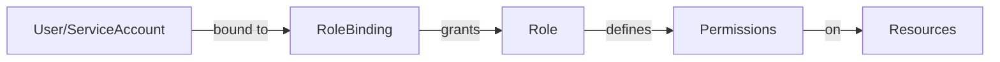

Kubewall provides comprehensive management for Kubernetes access control resources. Configure role-based access control (RBAC), manage service accounts, and control permissions across your cluster.

## Overview

Access control resources define who can access what resources in your Kubernetes cluster. Kubewall helps you visualize and manage these security-critical components through an intuitive interface.

## Available Access Control Resources

<CardGroup cols={2}>
  <Card title="Roles" icon="user-shield">
    Define permissions within a namespace. View allowed resources, verbs, and API groups.
  </Card>
  
  <Card title="ClusterRoles" icon="shield">
    Define cluster-wide permissions. View cluster-scoped resources and aggregation rules.
  </Card>
  
  <Card title="RoleBindings" icon="link">
    Grant Role permissions to users or service accounts within a namespace.
  </Card>
  
  <Card title="ClusterRoleBindings" icon="link">
    Grant ClusterRole permissions across the entire cluster.
  </Card>
  
  <Card title="ServiceAccounts" icon="robot">
    Provide identities for Pods to interact with the Kubernetes API.
  </Card>
</CardGroup>

## RBAC Overview

Role-Based Access Control (RBAC) is the standard method for controlling access to Kubernetes resources.

### RBAC Components



<Steps>
  <Step title="Identity">
    User, group, or service account that needs access.
  </Step>
  
  <Step title="Role/ClusterRole">
    Defines what operations are allowed on which resources.
  </Step>
  
  <Step title="RoleBinding/ClusterRoleBinding">
    Links the identity to the role, granting permissions.
  </Step>
</Steps>

## Roles

Roles define permissions within a single namespace. They specify which resources can be accessed and what operations are allowed.

### Role Information

View role details in Kubewall:

- **Name and Namespace**: Role identification
- **Rules**: Permission rules defined by the role
- **Resources**: Kubernetes resources the role can access
- **Verbs**: Allowed operations (get, list, create, etc.)
- **API Groups**: Resource API groups
- **Resource Names**: Specific resource instances (optional)
- **Age**: When the role was created

### Role Rules

Each rule in a Role specifies:

<Tabs>
  <Tab title="API Groups">
    The API group containing the resources:
    
    - `""` (core): Pods, Services, ConfigMaps, Secrets, etc.
    - `apps`: Deployments, StatefulSets, DaemonSets
    - `batch`: Jobs, CronJobs
    - `rbac.authorization.k8s.io`: Roles, RoleBindings
    - `networking.k8s.io`: Ingresses, NetworkPolicies
    - And more...
    
    **Wildcard:** `*` grants access to all API groups
  </Tab>
  
  <Tab title="Resources">
    The resource types the rule applies to:
    
    - `pods`, `services`, `configmaps`
    - `deployments`, `statefulsets`
    - `secrets`, `serviceaccounts`
    - `roles`, `rolebindings`
    
    **Subresources:** `pods/log`, `pods/exec`, `deployments/scale`
    
    **Wildcard:** `*` grants access to all resources
  </Tab>
  
  <Tab title="Verbs">
    The operations that can be performed:
    
    - `get`: Read a specific resource
    - `list`: List all resources of a type
    - `watch`: Watch for changes
    - `create`: Create new resources
    - `update`: Modify existing resources
    - `patch`: Partially update resources
    - `delete`: Delete resources
    - `deletecollection`: Delete multiple resources
    
    **Wildcard:** `*` allows all operations
  </Tab>
  
  <Tab title="Resource Names">
    Optional restriction to specific resource instances:
    
    ```yaml
    resourceNames:
      - my-specific-pod
      - my-specific-configmap
    ```
    
    **Effect:** Limits rule to only named resources
    
    **Use case:** Grant access to specific resources only
  </Tab>
</Tabs>

### Common Role Examples

<AccordionGroup>
  <Accordion title="Read-Only Role">
    View Pods, Services, and ConfigMaps:
    
    **Permissions:**
    - API Groups: `""` (core)
    - Resources: `pods`, `services`, `configmaps`
    - Verbs: `get`, `list`, `watch`
    
    **Use case:** Developers viewing application status
  </Accordion>
  
  <Accordion title="Developer Role">
    Manage application workloads:
    
    **Permissions:**
    - API Groups: `""`, `apps`
    - Resources: `pods`, `deployments`, `services`, `configmaps`
    - Verbs: `get`, `list`, `watch`, `create`, `update`, `delete`
    
    **Use case:** Application developers deploying and managing apps
  </Accordion>
  
  <Accordion title="Log Viewer Role">
    View container logs:
    
    **Permissions:**
    - API Groups: `""`
    - Resources: `pods`, `pods/log`
    - Verbs: `get`, `list`
    
    **Use case:** Support teams troubleshooting applications
  </Accordion>
</AccordionGroup>

### Viewing Role Details

1. Navigate to Access Control → Roles
2. Browse roles in selected or all namespaces
3. Select a role to view detailed permissions
4. Review all rules and allowed operations
5. Check which RoleBindings use this role
6. Export role definition for documentation

## ClusterRoles

ClusterRoles define permissions at the cluster level, applying to cluster-scoped resources or across all namespaces.

### ClusterRole Information

View ClusterRole details:

- **Name**: Global cluster role name
- **Rules**: Permission rules (similar to Roles)
- **Aggregation Rules**: Rules for aggregating other ClusterRoles
- **Resources**: Cluster and namespaced resources
- **Verbs**: Allowed operations
- **Non-Resource URLs**: Permissions for non-resource endpoints
- **Age**: When the ClusterRole was created

### ClusterRole vs Role

<CardGroup cols={2}>
  <Card title="ClusterRole" icon="globe">
    **Scope:** Cluster-wide
    
    **Can access:**
    - Cluster-scoped resources (Nodes, PVs, ClusterRoles)
    - Resources in all namespaces
    - Non-resource URLs (/healthz, /metrics)
    
    **Binding:**
    - ClusterRoleBinding: Cluster-wide access
    - RoleBinding: Namespace-specific access
  </Card>
  
  <Card title="Role" icon="folder">
    **Scope:** Single namespace
    
    **Can access:**
    - Resources within the namespace only
    - Cannot access cluster-scoped resources
    
    **Binding:**
    - RoleBinding: Must be in same namespace
  </Card>
</CardGroup>

### Cluster-Scoped Resources

ClusterRoles can grant access to:

- **Nodes**: Worker nodes in the cluster
- **PersistentVolumes**: Cluster-wide storage
- **Namespaces**: Namespace management
- **ClusterRoles/ClusterRoleBindings**: RBAC management
- **StorageClasses**: Storage provisioner definitions
- **CustomResourceDefinitions**: CRD management

### ClusterRole Aggregation

ClusterRoles can aggregate permissions from other ClusterRoles:

```yaml
aggregationRule:
  clusterRoleSelectors:
    - matchLabels:
        rbac.example.com/aggregate-to-monitoring: "true"
```

**Use case:** Build complex roles from smaller, reusable components

### Default ClusterRoles

Kubernetes provides several default ClusterRoles:

<Tabs>
  <Tab title="cluster-admin">
    Super-user access to all resources.
    
    **Grants:** Full control over the entire cluster
    
    **Use with caution:** Only for cluster administrators
  </Tab>
  
  <Tab title="admin">
    Full access within a namespace.
    
    **Grants:** All operations on most resources in a namespace
    
    **Cannot:** Modify ResourceQuotas or the namespace itself
  </Tab>
  
  <Tab title="edit">
    Read/write access to most resources.
    
    **Grants:** Create, update, delete most resources
    
    **Cannot:** View or modify Roles/RoleBindings
  </Tab>
  
  <Tab title="view">
    Read-only access to most resources.
    
    **Grants:** Get, list, watch most resources
    
    **Cannot:** View Secrets, Roles, or RoleBindings
  </Tab>
</Tabs>

## RoleBindings

RoleBindings grant the permissions defined in a Role to users, groups, or service accounts within a specific namespace.

### RoleBinding Information

View RoleBinding details:

- **Name and Namespace**: RoleBinding identification
- **Role Reference**: Which Role is being granted
- **Subjects**: Who receives the permissions
- **Subject Types**: User, Group, or ServiceAccount
- **Age**: When the binding was created

### RoleBinding Subjects

RoleBindings can grant permissions to:

<Tabs>
  <Tab title="Users">
    Individual user accounts:
    
    ```yaml
    subjects:
      - kind: User
        name: jane@example.com
        apiGroup: rbac.authorization.k8s.io
    ```
    
    **Note:** Kubernetes doesn't manage users directly; they come from external authentication.
  </Tab>
  
  <Tab title="Groups">
    Groups of users:
    
    ```yaml
    subjects:
      - kind: Group
        name: developers
        apiGroup: rbac.authorization.k8s.io
    ```
    
    **Use case:** Grant permissions to teams or departments
  </Tab>
  
  <Tab title="ServiceAccounts">
    Pod identities:
    
    ```yaml
    subjects:
      - kind: ServiceAccount
        name: my-service-account
        namespace: my-namespace
    ```
    
    **Use case:** Grant Pods access to Kubernetes API
  </Tab>
</Tabs>

### RoleBinding Best Practices

<AccordionGroup>
  <Accordion title="Principle of Least Privilege">
    - Grant minimum necessary permissions
    - Use specific resource names when possible
    - Avoid wildcard permissions
    - Regular audit of permissions
  </Accordion>
  
  <Accordion title="Organization">
    - Use descriptive names
    - Document the purpose of each binding
    - Group related permissions
    - Use namespace conventions
  </Accordion>
</AccordionGroup>

## ClusterRoleBindings

ClusterRoleBindings grant ClusterRole permissions at the cluster level.

### ClusterRoleBinding Information

View ClusterRoleBinding details:

- **Name**: Global binding name
- **ClusterRole Reference**: Which ClusterRole is being granted
- **Subjects**: Who receives the permissions
- **Subject Types**: User, Group, or ServiceAccount
- **Namespace**: Subject's namespace (for ServiceAccounts)
- **Age**: When the binding was created

### ClusterRoleBinding Scope

<Warning>
  ClusterRoleBindings grant permissions across the **entire cluster**. Use them carefully:
  
  - Avoid granting cluster-admin to service accounts
  - Prefer RoleBindings for namespace-scoped access
  - Regularly review ClusterRoleBindings
  - Document why cluster-wide access is needed
</Warning>

### Common ClusterRoleBinding Patterns

<Tabs>
  <Tab title="Cluster Monitoring">
    Grant monitoring tools read access to all resources:
    
    **Subject:** Monitoring service account
    **ClusterRole:** `view` or custom read-only role
    **Scope:** All namespaces
    
    **Use case:** Prometheus, Grafana, monitoring agents
  </Tab>
  
  <Tab title="Cluster Administration">
    Grant full cluster access to administrators:
    
    **Subject:** Admin users or group
    **ClusterRole:** `cluster-admin`
    **Scope:** Entire cluster
    
    **Use case:** Platform administrators
  </Tab>
  
  <Tab title="CI/CD Pipeline">
    Grant deployment permissions to CI/CD:
    
    **Subject:** CI/CD service account
    **ClusterRole:** Custom deployment role
    **Scope:** Selected namespaces
    
    **Use case:** Automated deployments
  </Tab>
</Tabs>

## ServiceAccounts

ServiceAccounts provide an identity for Pods to authenticate with the Kubernetes API.

### ServiceAccount Information

View ServiceAccount details:

- **Name and Namespace**: ServiceAccount identification
- **Secrets**: Associated authentication tokens
- **Image Pull Secrets**: Private registry credentials
- **Automount Service Account Token**: Whether to auto-inject token
- **Used By**: Pods using this ServiceAccount
- **Age**: When the ServiceAccount was created

### ServiceAccount Tokens

ServiceAccounts use tokens for authentication:

- **Automatic Creation**: Kubernetes creates tokens automatically
- **Pod Mounting**: Tokens mounted at `/var/run/secrets/kubernetes.io/serviceaccount/`
- **Token Contents**: JWT with identity and namespace information
- **Expiration**: Tokens may have expiration (TokenRequest API)

### Default ServiceAccount

Every namespace has a `default` ServiceAccount:

- Automatically created with the namespace
- Used by Pods that don't specify a ServiceAccount
- Has minimal permissions by default
- Can be customized with RoleBindings

<Info>
  Best practice: Create dedicated ServiceAccounts for applications instead of using the default.
</Info>

### Working with ServiceAccounts

<Steps>
  <Step title="Create ServiceAccount">
    Create a ServiceAccount in your namespace.
  </Step>
  
  <Step title="Grant Permissions">
    Create a Role defining required permissions.
    
    Create a RoleBinding linking the ServiceAccount to the Role.
  </Step>
  
  <Step title="Use in Pods">
    Reference the ServiceAccount in Pod specifications:
    
    ```yaml
    spec:
      serviceAccountName: my-service-account
    ```
  </Step>
  
  <Step title="Access API">
    Application code uses the mounted token to authenticate:
    
    - Token path: `/var/run/secrets/kubernetes.io/serviceaccount/token`
    - CA cert: `/var/run/secrets/kubernetes.io/serviceaccount/ca.crt`
    - Namespace: `/var/run/secrets/kubernetes.io/serviceaccount/namespace`
  </Step>
</Steps>

### ServiceAccount Security

<AccordionGroup>
  <Accordion title="Token Management">
    - Disable auto-mounting when not needed
    - Rotate tokens regularly
    - Use TokenRequest API for bound tokens
    - Monitor token usage
  </Accordion>
  
  <Accordion title="Permission Scoping">
    - Create ServiceAccounts per application
    - Grant only necessary permissions
    - Avoid reusing ServiceAccounts
    - Document permission requirements
  </Accordion>
  
  <Accordion title="Image Pull Secrets">
    - Attach registry credentials to ServiceAccounts
    - Use separate ServiceAccounts for different registries
    - Rotate registry credentials
  </Accordion>
</AccordionGroup>

## Common Operations

For all access control resources:

### Viewing Resources
- **List View**: Browse all RBAC resources with filtering
- **Details View**: Inspect permissions and bindings
- **YAML View**: View complete resource definitions
- **Events**: Monitor related Kubernetes events

### Managing Resources
- **Delete**: Remove roles, bindings, or service accounts
- **Real-time Updates**: Automatic refresh with SSE
- **Export**: Download resource configurations
- **Multi-select**: Operate on multiple resources

## Troubleshooting Access Issues

### Permission Denied Errors

<Steps>
  <Step title="Identify the Subject">
    Determine which user or ServiceAccount is being denied.
  </Step>
  
  <Step title="Check Bindings">
    Verify RoleBindings and ClusterRoleBindings for the subject.
  </Step>
  
  <Step title="Review Roles">
    Check that Roles grant the required permissions.
  </Step>
  
  <Step title="Verify Scope">
    Ensure the Role/ClusterRole scope matches the resource location.
  </Step>
</Steps>

### Common Issues

<Check>
  - **No RoleBinding exists** for the user/ServiceAccount
  - **Role doesn't include** the required resource or verb
  - **Namespace mismatch** between RoleBinding and resource
  - **ClusterRole needs ClusterRoleBinding** for cluster resources
  - **ServiceAccount token** not mounted or expired
</Check>

## Real-time Monitoring

All access control resources benefit from real-time updates:
- Automatic refresh using Server-Sent Events
- Immediate visibility into permission changes
- Live binding updates
- No manual refresh required

## Best Practices

<AccordionGroup>
  <Accordion title="Security">
    - Apply principle of least privilege
    - Regularly audit RBAC configurations
    - Avoid cluster-admin bindings
    - Use namespaces for isolation
    - Document permission rationale
  </Accordion>
  
  <Accordion title="Organization">
    - Use consistent naming conventions
    - Create reusable ClusterRoles
    - Group related permissions
    - Version control RBAC configs
    - Automate RBAC management
  </Accordion>
  
  <Accordion title="Maintenance">
    - Remove unused ServiceAccounts
    - Clean up orphaned RoleBindings
    - Review permissions regularly
    - Update roles as requirements change
    - Monitor for permission escalation
  </Accordion>
</AccordionGroup>

## Authentication vs Authorization

<CardGroup cols={2}>
  <Card title="Authentication" icon="id-card">
    **Who are you?**
    
    Handled outside Kubernetes:
    - Client certificates
    - Bearer tokens
    - OIDC providers
    - Webhook authentication
    
    Kubewall uses your cluster's authentication.
  </Card>
  
  <Card title="Authorization" icon="shield-check">
    **What can you do?**
    
    Handled by RBAC:
    - Roles define permissions
    - RoleBindings grant permissions
    - Kubernetes evaluates all bindings
    
    Managed through Kubewall's RBAC interface.
  </Card>
</CardGroup>

## Next Steps

<CardGroup cols={2}>
  <Card title="Configuration Resources" icon="gear" href="/resources/configuration">
    Learn about ConfigMaps, Secrets, and configuration management
  </Card>
  
  <Card title="Custom Resources" icon="puzzle-piece" href="/resources/custom-resources">
    Explore Custom Resource Definitions and custom resources
  </Card>
</CardGroup>