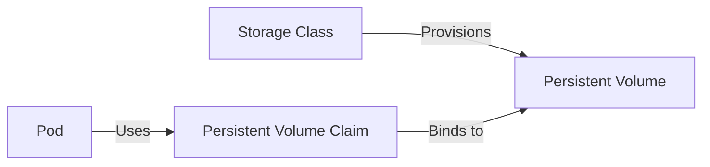

Kubewall provides comprehensive management for Kubernetes storage resources. Configure persistent volumes, manage storage classes, and monitor volume claims to ensure your applications have reliable, persistent storage.

## Overview

Storage resources enable stateful applications to persist data beyond Pod lifecycles. Kubewall helps you manage the entire storage lifecycle, from defining storage classes to provisioning and binding persistent volumes.

## Available Storage Resources

<CardGroup cols={2}>
  <Card title="Persistent Volumes" icon="hard-drive">
    Cluster-wide storage resources provisioned by administrators. View capacity, access modes, reclaim policies, and binding status.
  </Card>
  
  <Card title="Persistent Volume Claims" icon="file-contract">
    Storage requests from applications. Monitor claim status, bound volumes, capacity, and access modes.
  </Card>
  
  <Card title="Storage Classes" icon="layer-group">
    Define storage provisioners and parameters. View available storage types, provisioners, and volume binding modes.
  </Card>
</CardGroup>

## Storage Architecture

Understanding the relationship between storage resources:

1. **Storage Class**: Defines the type of storage (SSD, HDD, NFS, etc.)
2. **Persistent Volume (PV)**: Actual storage resource in the cluster
3. **Persistent Volume Claim (PVC)**: Request for storage by an application
4. **Pod**: Mounts and uses the PVC as a volume

## Persistent Volumes (PV)

Persistent Volumes are cluster-level resources that represent physical storage. They exist independently of Pods and have lifecycles managed by administrators.

### PV Information

Kubewall displays comprehensive PV details:

- **Name**: Unique identifier for the volume
- **Capacity**: Total storage size (e.g., 10Gi, 100Gi)
- **Access Modes**: How the volume can be mounted
- **Reclaim Policy**: What happens when the PVC is deleted
- **Status**: Available, Bound, Released, or Failed
- **Claim**: Which PVC is bound to this PV
- **Storage Class**: Associated storage class name
- **Volume Mode**: Filesystem or Block
- **Age**: When the PV was created

### Access Modes

Persistent Volumes support different access modes:

<Tabs>
  <Tab title="ReadWriteOnce (RWO)">
    Volume can be mounted as read-write by a single node.
    
    **Common uses:**
    - Databases (MySQL, PostgreSQL)
    - Single-instance applications
    - Block storage volumes
    
    **Providers:**
    - AWS EBS
    - GCE Persistent Disks
    - Azure Disk
  </Tab>
  
  <Tab title="ReadOnlyMany (ROX)">
    Volume can be mounted as read-only by many nodes.
    
    **Common uses:**
    - Static content distribution
    - Configuration data
    - Reference data
    
    **Providers:**
    - NFS
    - CephFS
    - GlusterFS
  </Tab>
  
  <Tab title="ReadWriteMany (RWX)">
    Volume can be mounted as read-write by many nodes simultaneously.
    
    **Common uses:**
    - Shared application data
    - Multi-instance stateful apps
    - Collaborative workspaces
    
    **Providers:**
    - NFS
    - CephFS
    - GlusterFS
    - Azure File
    - AWS EFS
  </Tab>
  
  <Tab title="ReadWriteOncePod (RWOP)">
    Volume can be mounted as read-write by a single Pod (Kubernetes 1.22+).
    
    **Common uses:**
    - Strict single-writer scenarios
    - Enhanced data safety
    - StatefulSet with single replica
  </Tab>
</Tabs>

### Reclaim Policies

Defines what happens to the PV when its PVC is deleted:

<AccordionGroup>
  <Accordion title="Retain">
    The PV remains after PVC deletion, allowing manual reclamation of data.
    
    **Best for:**
    - Production databases
    - Critical data
    - Manual backup workflows
    
    **Status after deletion:**
    - PV changes to "Released" state
    - Data remains intact
    - Requires manual cleanup or rebinding
  </Accordion>
  
  <Accordion title="Delete">
    Both the PV and underlying storage are deleted when the PVC is deleted.
    
    **Best for:**
    - Development environments
    - Temporary data
    - Dynamically provisioned volumes
    
    **Status after deletion:**
    - PV is deleted automatically
    - Underlying storage is removed
    - Data is permanently lost
  </Accordion>
  
  <Accordion title="Recycle (Deprecated)">
    Basic scrub of the volume, making it available for a new claim.
    
    **Note:** This policy is deprecated and should not be used for new volumes.
  </Accordion>
</AccordionGroup>

### PV Status

- **Available**: PV is free and not yet bound to a claim
- **Bound**: PV is bound to a PVC and in use
- **Released**: PVC was deleted, but resource not yet reclaimed
- **Failed**: PV has failed its automatic reclamation

### Viewing PV Details

1. Navigate to Storage → Persistent Volumes
2. Browse all available PVs in your cluster
3. Click on a PV to view detailed information
4. Check binding status and associated PVC
5. View the YAML definition for complete specifications
6. Monitor events for provisioning or binding issues

## Persistent Volume Claims (PVC)

Persistent Volume Claims are requests for storage by applications. They specify size, access modes, and optionally a storage class.

### PVC Information

Monitor PVC details in Kubewall:

- **Name and Namespace**: Claim identification
- **Status**: Pending, Bound, or Lost
- **Volume**: Name of the bound PV
- **Capacity**: Requested storage size
- **Access Modes**: Requested access mode
- **Storage Class**: Requested or default storage class
- **Volume Mode**: Filesystem or Block
- **Used By**: Pods mounting this PVC
- **Age**: When the claim was created

### PVC Lifecycle

<Steps>
  <Step title="Claim Creation">
    Application creates a PVC specifying storage requirements:
    - Desired capacity
    - Access mode needed
    - Storage class (optional)
    - Volume mode
  </Step>
  
  <Step title="Volume Binding">
    Kubernetes finds or provisions a matching PV:
    - Searches for available PV matching requirements
    - If no match and storage class supports it, provisions new PV
    - Binds PVC to PV
    - Updates PVC status to Bound
  </Step>
  
  <Step title="Pod Usage">
    Pod mounts the PVC as a volume:
    - References PVC in volume specification
    - Kubernetes mounts the bound PV
    - Application reads/writes data
  </Step>
  
  <Step title="Cleanup">
    When PVC is deleted:
    - Pod must release the volume first
    - PV follows its reclaim policy
    - Storage may be retained or deleted
  </Step>
</Steps>

### PVC Status

- **Pending**: Waiting for a PV to bind
- **Bound**: Successfully bound to a PV
- **Lost**: Bound PV was deleted

### Viewing PVC Details

1. Navigate to Storage → Persistent Volume Claims
2. View all PVCs in selected namespace or across all namespaces
3. Select a PVC to see detailed information
4. Check which Pods are using the PVC
5. View the bound PV details
6. Monitor binding events and issues

## Storage Classes

Storage Classes define different types of storage available in your cluster. They abstract the underlying storage provider and allow dynamic provisioning.

### Storage Class Information

View storage class configuration:

- **Name**: Storage class identifier
- **Provisioner**: Storage backend (e.g., kubernetes.io/aws-ebs)
- **Parameters**: Provider-specific settings
- **Reclaim Policy**: Default policy for dynamically provisioned PVs
- **Volume Binding Mode**: Immediate or WaitForFirstConsumer
- **Allow Volume Expansion**: Whether volumes can be resized
- **Mount Options**: Default mount options
- **Is Default**: Whether this is the default storage class
- **Age**: When the storage class was created

### Common Storage Provisioners

<Tabs>
  <Tab title="Cloud Providers">
    **AWS EBS**
    - Provisioner: `kubernetes.io/aws-ebs` or `ebs.csi.aws.com`
    - Block storage for AWS EC2
    - Multiple volume types (gp3, gp2, io1, io2)
    
    **GCE Persistent Disk**
    - Provisioner: `kubernetes.io/gce-pd` or `pd.csi.storage.gke.io`
    - Block storage for Google Cloud
    - SSD and standard disk types
    
    **Azure Disk**
    - Provisioner: `kubernetes.io/azure-disk` or `disk.csi.azure.com`
    - Block storage for Azure VMs
    - Premium SSD, Standard SSD, Standard HDD
    
    **Azure File**
    - Provisioner: `kubernetes.io/azure-file` or `file.csi.azure.com`
    - Shared file storage
    - Supports ReadWriteMany
  </Tab>
  
  <Tab title="Network Storage">
    **NFS**
    - Provisioner: External NFS provisioner
    - Shared file storage
    - Supports ReadWriteMany
    - Requires NFS server
    
    **CephFS**
    - Provisioner: `cephfs.csi.ceph.com`
    - Distributed file system
    - High performance and scalability
    
    **GlusterFS**
    - Provisioner: `kubernetes.io/glusterfs`
    - Distributed file system
    - Scale-out storage
  </Tab>
  
  <Tab title="Local Storage">
    **Local Persistent Volumes**
    - Provisioner: `kubernetes.io/no-provisioner`
    - Node-local storage
    - High performance
    - No replication (data loss if node fails)
    
    **HostPath**
    - Provisioner: N/A (manually provisioned)
    - Direct host filesystem access
    - Development/testing only
    - Not recommended for production
  </Tab>
</Tabs>

### Volume Binding Modes

<CardGroup cols={2}>
  <Card title="Immediate" icon="bolt">
    PV is provisioned and bound as soon as PVC is created.
    
    **Pros:**
    - Faster claim binding
    - Simpler behavior
    
    **Cons:**
    - May provision PV in wrong zone
    - Can cause Pod scheduling issues
  </Card>
  
  <Card title="WaitForFirstConsumer" icon="clock">
    PV provisioning delayed until a Pod uses the PVC.
    
    **Pros:**
    - PV created in correct zone for Pod
    - Better resource utilization
    - Avoids cross-zone mounting issues
    
    **Cons:**
    - Slightly slower first mount
  </Card>
</CardGroup>

### Default Storage Class

One storage class can be marked as default:
- Used when PVC doesn't specify a storage class
- Indicated by annotation: `storageclass.kubernetes.io/is-default-class: "true"`
- Only one default per cluster recommended

## Common Operations

Kubewall supports these operations for all storage resources:

### Viewing Resources
- **List View**: Browse all storage resources with filtering
- **Details View**: Inspect specifications and status
- **YAML View**: View complete resource definitions
- **Events**: Monitor provisioning and binding events

### Managing Resources
- **Delete**: Remove PVs, PVCs, or storage classes
- **Real-time Updates**: Automatic refresh with SSE
- **Export**: Download resource configurations
- **Multi-select**: Operate on multiple resources

## Dynamic vs Static Provisioning

<Tabs>
  <Tab title="Dynamic Provisioning">
    Storage is automatically created when needed.
    
    **How it works:**
    1. Define StorageClass with provisioner
    2. Create PVC referencing the StorageClass
    3. Kubernetes provisions PV automatically
    4. PVC binds to new PV
    
    **Advantages:**
    - No manual PV creation
    - On-demand provisioning
    - Self-service for developers
    - Better resource utilization
    
    **Best for:**
    - Cloud environments
    - Self-service platforms
    - Development environments
  </Tab>
  
  <Tab title="Static Provisioning">
    Administrator pre-creates PVs, applications claim them.
    
    **How it works:**
    1. Admin creates PV manually
    2. Create PVC with matching requirements
    3. Kubernetes binds PVC to existing PV
    
    **Advantages:**
    - Full control over storage
    - Pre-configured volumes
    - Custom storage setups
    
    **Best for:**
    - On-premises environments
    - Legacy storage systems
    - Special storage requirements
  </Tab>
</Tabs>

## Troubleshooting Storage Issues

### PVC Stuck in Pending

<Check>
  - Verify matching PV exists (static provisioning)
  - Check storage class exists and provisioner is running
  - Ensure requested capacity is available
  - Verify access mode is supported
  - Review PVC events for error messages
  - Check storage class parameters are valid
</Check>

### Pod Cannot Mount Volume

<Check>
  - Confirm PVC is bound to a PV
  - Verify node supports the volume type
  - Check volume is not already mounted (RWO mode)
  - Review Pod events for mount errors
  - Ensure CSI driver is installed (if using CSI)
  - Verify filesystem type is supported
</Check>

### Volume Provisioning Failed

<Check>
  - Check storage class provisioner is running
  - Verify cloud provider credentials are valid
  - Ensure quota limits are not exceeded
  - Review storage class parameters
  - Check provisioner logs for errors
  - Verify network connectivity to storage backend
</Check>

## Real-time Monitoring

All storage resources benefit from real-time updates:
- Automatic status refresh using Server-Sent Events
- Live binding status updates
- Real-time capacity changes
- Immediate visibility into provisioning events
- No manual refresh required

## Best Practices

<AccordionGroup>
  <Accordion title="Storage Class Design">
    - Create multiple storage classes for different use cases
    - Use descriptive names (e.g., fast-ssd, standard-hdd)
    - Set appropriate default storage class
    - Enable volume expansion where supported
    - Use WaitForFirstConsumer for zone-aware provisioning
  </Accordion>
  
  <Accordion title="PVC Management">
    - Request only needed capacity
    - Specify appropriate access modes
    - Use storage classes instead of specific PVs
    - Set resource quotas to prevent overprovisioning
    - Document PVC usage and requirements
  </Accordion>
  
  <Accordion title="Data Protection">
    - Use Retain policy for critical data
    - Implement backup strategies
    - Test restore procedures regularly
    - Monitor storage capacity and usage
    - Plan for disaster recovery
  </Accordion>
  
  <Accordion title="Performance Optimization">
    - Choose appropriate storage types for workload
    - Use local storage for high-performance needs
    - Consider ReadWriteMany overhead
    - Monitor I/O metrics
    - Right-size volume capacity
  </Accordion>
</AccordionGroup>

## Volume Snapshots

While Kubewall focuses on core storage resources, many storage providers support volume snapshots for backup and cloning. Check your [Custom Resources](/resources/custom-resources) for VolumeSnapshot CRDs.

## Next Steps

<CardGroup cols={2}>
  <Card title="Workload Resources" icon="rocket" href="/resources/workloads">
    Learn how workloads use persistent storage
  </Card>
  
  <Card title="Configuration Resources" icon="gear" href="/resources/configuration">
    Explore ConfigMaps, Secrets, and configuration management
  </Card>
</CardGroup>